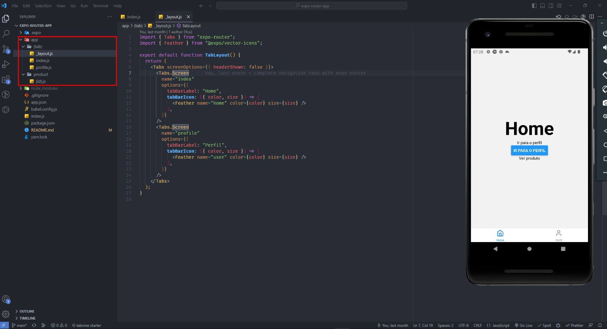

<h1 align="center">Expo Router</h1>

    

## :computer: Projeto

O Expo Router é uma nova forma de trabalhar com navegação dentro do React Native e diferente do React Navigation onde é possível criar um arquivo de navegação, o Expo Router trabalhar com File System Routing, ou seja, as rotas são definidas através de uma hierarquia de pastas e arquivos.

## :rocket: Tecnologias

Foram usadas as seguintes tecnologias:

- [React Native](https://reactnative.dev)
- [Expo](https://expo.dev)
- [Expo Router](https://expo.github.io/router/docs/)
